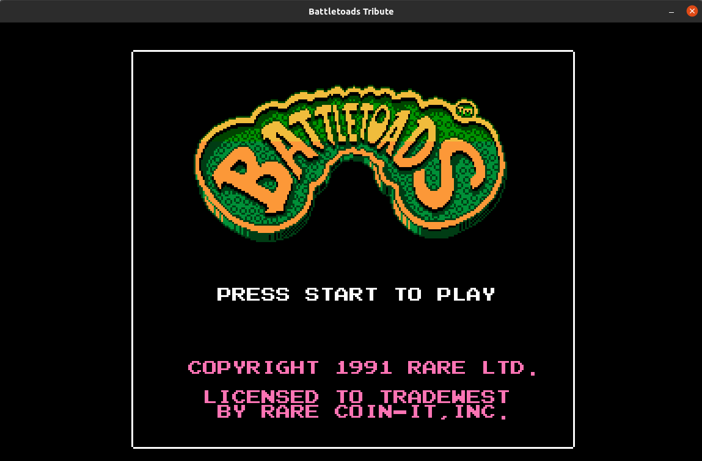

# BattleToads Tribute
Master 2nd Project
<br>
Author: Raul Rodolfo Trevino Vazquez
<br>
About:
This is a tribute for the game BattleToads , for my master program in UPC.
<br>
Link Github
https://rtv313.github.io/BattleToadsTribute/
[GitHub](https://rtv313.github.io/BattleToadsTribute/)
<br>
Link Licence https://github.com/rtv313/BattleToadsTribute/blob/master/LICENSE
[License](https://github.com/rtv313/BattleToadsTribute/blob/master/LICENSE)
<br>
Releases https://github.com/rtv313/BattleToadsTribute/releases
[Release](https://github.com/rtv313/BattleToadsTribute/releases)

#Instrucctions:
<ul>
<li>"Objective" = Reach the end of the level</li>
<li>"WASD" = Move</li>
<li> "Shift" = RUN</li>
<li> "M" = Normal hit</li>
<li> "N" = Kick</li>
<li> "B" = Super hit</li>
<li> "F1" = Debug Mode </li>
</ul>

<br>

[](https://www.youtube.com/embed/_G7BSwTtMhA)


# Linux

Tested on Ubuntu 20.04

Dependencies

```
make dep compile run
```

# Mac

```
make dep-mac compile run
```